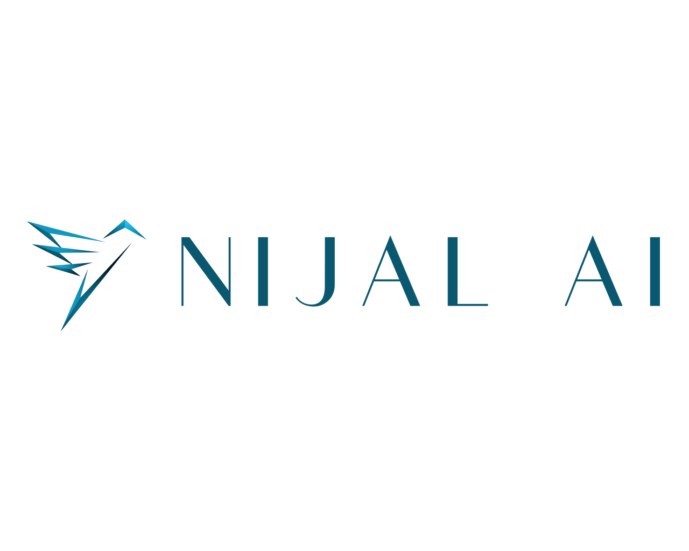

<!-- Logo -->

  

---

<!-- Bandeau de liens -->
  

    
    
    
        
  

  
---
# Nijal AI

**Experts en agents IA sur mesure**, basés à Brest.  
Nous concevons des agents intelligents autonomes pour redonner du temps aux équipes en automatisant les tâches répétitives.
****

---
##  Notre domaine d’expertise

| Icône | Service |
|:-----:|:--------|
| 🤖 | Agents IA autonomes sur mesure |
| 🌐 | Déploiement d’agents intelligents (ex. A2A, Agent-to-Agent) |
| ⚙️ | Protocoles intelligents “Model Context Protocol” (MCP) |

---

##  Projet Open-Source à découvrir

### **MCP Server (Model Context Protocol)** – *Nijal-AI/brest-mcp-server*

Serveur MCP de la région de Brest, facilitant l'accès des données publics au agent IA, avec inspection intégrée et un agent IA accessible via A2A (agent-to-agent).  
👉 [Voir le projet sur GitHub](https://github.com/Nijal-AI/brest-mcp-server)

### **Brest RAG (Retrieval Augmented Generation)** – *Nijal-AI/brest-rag*

Chatbot RAG permettant de réaliser des recherches documentaires sur la région de Brest, facilitant la recherche d'informations, et intégrant un pipeline RAG avec Guardrail, reranking, contextualisation et pipeline d'ingestion.
👉 [Voir le projet sur GitHub](https://github.com/Nijal-AI/brest-rag)

